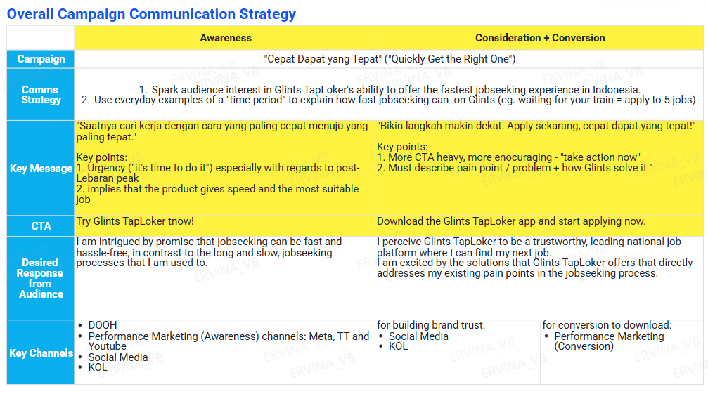
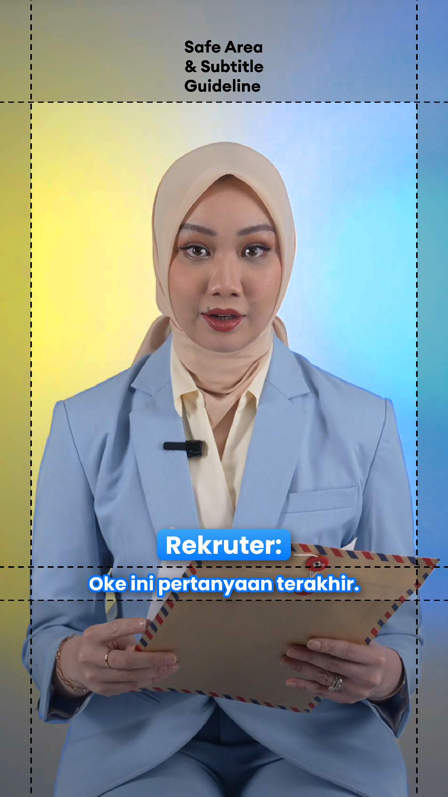

# Marketing Campaigns Portfolio
**Laurice Wong** · Head of Strategy & Marketing, Glints TapLoker · Apr 2024 – Present

---

## Platform Results (2 years)

| Metric | Start | Now |
|---|---|---|
| Monthly Active Users | ~1M | **3M+** |
| Blended CPA (first open) | ~$0.13–0.17 | **$0.07** |
| Market position (Indonesia) | #3 | **#1** most downloaded job app |
| Monthly impressions | ~50M | **400M+** |
| Social media followers | ~500K | **2M+** |
| Organic install % | ~46% | **70%+** |

*Full B2B / employer-side metrics available on request.*

---

## Campaign 1 — "1001 Perjuangan, Sejuta Cara"
### 2025 Post-Lebaran · April–May 2025

**Why**
- Glints was #3 in the market; needed to close the brand awareness gap vs. Jobstreet (3x stronger in branded search)
- Organic installs were ~46% — needed to shift toward a sustainable, less paid-dependent acquisition model

**Who**
- Indonesian job seekers aged 18–34, 0–3 years experience, primarily blue-collar and lower white-collar in Java
- Core tension: family pressure to be "settled" after the holiday vs. uncertainty about where to start

**Why now**
- Post-Lebaran is Indonesia's single highest-intent job-search window — millions return from hometown holidays reconsidering careers
- All competitors also peak spend here, so standing out requires content quality and emotional differentiation, not just budget

**Strategy**
- Led with emotional resonance, not product — content named the specific anxieties (family pressure, blank months, fear of being behind) rather than describing app features
- Dropped high-effort/low-ROI formats (job fairs, webinars) entirely based on prior campaign data; concentrated budget on sustained digital awareness instead
- KOL mix spanned career-focused *and* lifestyle/entertainment verticals to reach beyond already-converted job seekers
- Shifted budget split to 67% awareness / 33% conversion (vs. BAU 80/20) to test thesis that awareness investment lowers downstream CPA — confirmed: cost per MAU dropped 64%

**Campaign results**

| KPI | Benchmark | Actual |
|---|---|---|
| Total impressions | — | **90M+** |
| Blended CPA first open | $0.116 | **$0.098** (−15%) |
| Cost per incremental MAU | — | **−64%** vs non-campaign |
| MAU growth (campaign month) | — | **+236K** |
| Store listing CR | 34.3% | **35.4%** |
| Organic install % | ~50% | **55%** |
| Social follower growth | — | **+53,580** |
| Total spend | $112K budget | **$106K** (under) |

**Top-performing content**

| Content | Platform | Impressions | Likes | Shares/Saves | Link |
|---|---|---|---|---|---|
| "Anita's prayer to get a job" | IG @glintsid | **1,398,334** 🔥 | 13,647 | 450 shares / 2,869 saves | *(add link)* |
| "List of questions to ask HRD at end of interview" | IG @glintsid | 279,851 | 20,991 | 450 shares | *(add link)* |
| "What motivates you to work in Jakarta?" | TikTok | 569,897 | 2,373 | 76 shares | *(add link)* |
| "CV tips for fresh grads" | TikTok | 458,400 | 2,583 | 137 shares | *(add link)* |
| "How to follow up with HRD" | IG @glintsid | **740,369** | — | — | *(add link)* |

**KOL partners**

| KOL | Platform | Followers | Avg Views | ER | Content Links |
|---|---|---|---|---|---|
| @syairadelima | TikTok/IG | 15.7K | 16K | **11%** | [Post 1](https://www.instagram.com/p/C3AQiTnvRMF/) · [Post 2](https://www.instagram.com/reel/C3DJ0AWPUKf/) |
| @aim.alxndr | TikTok | 4.9K | 70.6K | **8.5%** | [Post 1](https://vt.tiktok.com/ZSF8PhJUQ/) · [Post 2](https://www.tiktok.com/@aim.alxndr/video/7332094581539867910) |
| @arimbanop | Instagram | 24.3K | 13.5K | **4.9%** | [Post 1](https://www.instagram.com/reel/C24c5fGpkgB/) · [Post 2](https://www.instagram.com/reel/C3DF_-UpL1I/) |
| @ichaagustiya | TikTok | 32.1K | 10.5K | **6.3%** | [Post 1](https://vt.tiktok.com/ZSFYNa3Tj/) · [Post 2](https://vt.tiktok.com/ZSFYNBPcR/) |
| @mellayustica | TikTok | 22.1K | 9.9K | **4.4%** | [Post 1](https://www.tiktok.com/@mellayustica/video/7331927596722113798) · [Post 2](https://www.tiktok.com/@mellayustica/video/7333456769726844165) |

*Campaign creative assets — [add screenshots/key visual here]*

---

## Campaign 2 — "Gak Harus Jago" ("You Don't Have to Be Perfect")
### 2025 Fresh Graduate Campaign · July–August 2025

**Why**
- Fresh grad season is Glints' second-highest acquisition window; needed to own the cohort before competitors
- Needed to sustain organic acquisition gains from April campaign into the H2 low season
- Performance marketing was over-indexed; blended CPA had room to improve significantly

**Who**
- Indonesian fresh graduates aged 20–24 from university and vocational backgrounds
- Core tension: imposter syndrome about competing without experience; high sensitivity to peer validation and social proof
- TikTok-native; responds to storytelling and relatable humour over product claims

**Why now**
- Graduation season creates a defined, high-intent window when this cohort is actively job hunting for the first time
- 2025 cohort specifically anxious: tighter market, and social comparison amplified by LinkedIn/peer pressure

**Strategy**
- Tagline directly answered the core barrier ("you don't have to be perfect") rather than describing the product
- Built content around KOL skits dramatising real fresh grad moments (unemployed alumni asking about job progress, financial anxiety of being born in 2007) — product introduced at the end, *earned* not forced; this format drove 2–5x impressions vs. standard product posts
- Launched Glints' first TikTok Live career series: 4 sessions with different KOLs (interview prep, CV, portfolio, Gen Z at work) — community touchpoint, not product demo
- Ran a live incrementality test (Jul 26–27): switched off all paid channels for a full weekend to measure organic lift; found ~23% of remaining spend was still cannibalistic → redirected $20K to brand and PR; reached year-end CPA target 3 months early

**Campaign results**

| KPI | Benchmark | Actual |
|---|---|---|
| Monthly impressions (July) | ~80M | **102M** (+25% MoM) |
| Blended CPA first open | $0.116 | **$0.07** *(year-end target, hit early)* |
| Brand/Perf split | 17% / 83% | **35% / 65%** |
| Organic install % | 46% | **70%+** |
| PM spend savings vs plan | — | **−$20K July; −$50K+ H2 forecast** |
| TikTok Live (per session) | (first time) | **~3K viewers · ~7K likes · 200+ comments** |

**Top-performing content**

| Content | Platform | Impressions | Likes | Shares/Saves | Link |
|---|---|---|---|---|---|
| "Gen Z common mistakes in interviews" | TikTok | **1,500,000** 🔥 | 25,000 | 410 / 1,417 saves | *(add link)* |
| "CV Series: How to choose skills" | TikTok | **1,386,744** 🔥 | 75,000 | 4,936 / 53,000 saves | *(add link)* |
| "Prayers to ease job seeking in this economy" | IG @glintsid | 604,515 | 49,623 | 3,903 shares | *(add link)* |
| "Gojek driver's story: finding a job today" | IG @glintsid | 581,548 | 25,765 | 1,077 shares | *(add link)* |
| "40 verbs to use on your CV" | IG @glintsid | 992,048 | 7,171 | 1,007 shares | *(add link)* |

*Campaign creative assets — [add screenshots/key visual here]*

---

## Campaign 3 — "Cepat Dapat yang Tepat" ("Quickly Get the Right One")
### 2026 H1 Post-Lebaran · March–May 2026

**Why**
- Glints had reached #1 in Indonesia but needed to consolidate lead: close the gap on Jobstreet's install volume and MAU, and land a durable brand positioning beyond "another job app"
- Previous campaigns proved that brand awareness investment drives cheaper acquisition downstream — 2026 was the year to scale that thesis with a landmark campaign

**Who**
- Indonesian job seekers aged 18–34, post-Lebaran re-entry moment
- Extended to commuter and mudik-travel audiences via DOOH at train stations — people in physical "waiting" moments who could apply during transit

**Why now**
- Post-Lebaran 2026 was the first peak season where Glints had both market leadership *and* a fresh, tested brand direction to push hard on
- Lebaran travel moment created a unique context for DOOH: millions of commuters and mudik travellers with idle time, directly captured by "waiting for train = apply to 5 jobs" messaging

**Strategy**
- Two-phase comms: *Awareness* ("fastest job search") used micro-moment copywriting tied to everyday wait times; *Conversion* shifted to feature-specific pain-point storytelling with Vina's HR credibility as anchor
- Signed Vina Muliana (Indonesia's top HR-professional content creator) for 4 dedicated TikTok product videos (one per feature: 1-Tap Apply, Chat with HR, FYP, Jobs Nearby), DOOH usage rights, and 1 IG Live CV review session
- KOL storyline used two competing characters ("Devina & her world" vs. "Devina vs Cherry") to create audience voting and episodic engagement across the campaign window
- Introduced three novel formats not used in prior campaigns:
  - **DOOH** at 10 commuter/mudik train stations and road sites — contextual placement at moments of maximum idle time
  - **Roblox gamification** — 14-day branded fishing game tied to job roles; unlocked in-game CV review on completion (42K DAP target; 2.8M impressions W1–2)
  - **Sticker branding** at universities, bus stops, ojek helmets — created persistent "waiting = apply" brand association at low cost ($2.6K, 1.7M est. impressions)

**Campaign KPIs & budget**

| KPI | Target |
|---|---|
| Total impressions | 425M at $0.16 blended CPM |
| Installs | 2x 2025 peak = 2.8M |
| App MAU | 2.5–3M |
| Brand keyword Google search vol. | +50% to 350–400K/month |
| Total budget (2 months) | ~$288K |

**Early results (Weeks 1–5, in-flight)**

| Week | Blended Installs | Sign Ups | FTA1D |
|---|---|---|---|
| W1 | 161,287 | 87,399 | 31,612 |
| W2 | 168,720 | 90,794 | 33,371 |
| W3 | 172,839 | 96,557 | 35,552 |
| W4 | **191,736** | **112,602** | **40,964** |
| W5 | 182,545 | 108,246 | 39,856 |

*Tracking ~40% ahead of 2025 equivalent weeks on install velocity. Vina's peak organic TikTok post: 4.5M impressions. Roblox: 2.8M impressions in 2 weeks vs. 42K DAP target.*

**Campaign comms strategy**

**KOL creative — Vina Muliana production stills**

| | |
|---|---|
|  |  |

**Vina TikTok content**

| Feature | Link | Notes |
|---|---|---|
| Chat with HR | [Watch →](https://www.tiktok.com/@vmuliana/video/7519103729186917688) | Feature intro skit |
| 1-Tap Apply | [Watch →](https://www.tiktok.com/@vmuliana/video/7574796868962602258) | Speed demo |
| FYP / For You | [Watch →](https://www.tiktok.com/@vmuliana/video/7226326897951640858) | Discovery feature |
| Jobs Nearby | [Watch →](https://www.tiktok.com/@vmuliana/video/7560376756511837458) | Location feature |

**Full campaign brief:** https://glints.sg.larksuite.com/wiki/SseNwBzDLiDWajkuO5nlH9W6g0c

---

*laurice.wong@gmail.com · github.com/lslwong · May 2026*
