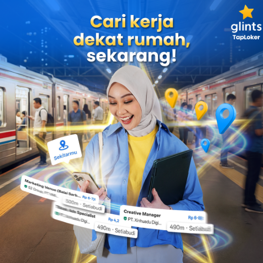

# Marketing Portfolio 

**Laurice Wong**

👩🏻‍💻Head of Strategy & Marketing @ Glints\
⏳Previously Strategy and Finance @ Deliveroo, Investment Banking @ Goldman Sachs\
🌱Passionate about building solutions for hard problems across domains - I thrive as a generalist and I like to keep my toolkit diverse.

---

🚀 Building Southeast Asia's fastest growing job app at Glints. Created for the region's young and mobile-first workforce and entrepreneurs, our app recognises that direct accessibility and simplicity mattered the most to our users (most of whom are approaching jobseeking and hiring via online channels for the first time in their lives). This led  us to pioneer the region's first in-app chat-based hiring process.

---

# Candidate Marketing

✍️ On the consumer side, jobseeking is a long-cycle, non-incentivizable consumer behaviour that requires significant brand trust. We chose to focus on building a brand narrative combining relatable everyday career struggles and practical jobseeking advice and solutions, led by social media channels, to reach our audiences at every point of their daily working experiences.

## Overall Platform Results (2 year tenure as Head of Strategy & Marketing)

| Metric | Before | Now |
|---|---|---|
| Monthly Active Users | ~1M | **3M+** (3x, became market leader) |
| Blended Cost per Install | ~$0.13–0.17 | **$0.07** (-50%) |
| Market position (Indonesia) | #3 | **#1** most downloaded job app |
| Monthly brand content impressions | ~50M | **660M+** (13x) |
| Social media followers | ~700K | **2M+** (3x) |
| % of Organic Installs | ~30% | **70%+** (>2x) |

**Growth Highlights**
1. Significantly simplified performance marketing campaign structure, built sustainable creative production flow to ensure strong creative testing and variation to drive down paid acquisition costs by 50%
2. Doubled down on organic social media through data-bsaed content strategy refinement. Built 2 new viral IG and TT accounts and grew volume of organic installs by 2-3x, share of organic installs by ~30-35ppt     
3. Built KOL strategy from scratch to ~20M+ views monthly and reducing CPM by 80% over 2 years
4. Led major rebranding effort and developed Glints’ first brand messaging framework 

---

## Winning Campaign Case Study — "Cepat Dapat yang Tepat" ("Quickly Get the Right One")

### 2026 H1 Post-Lebaran · March–May 2026

**Why**
- Glints had reached #1 market position in Indonesia but needed to consolidate lead, and land a durable and differentiated brand positioning beyond "another job app". Hired Indonesia's top career KOL Vina Muliana (10M+ TT followers) to build trust among the mass market audience
- Previous campaigns proved that brand awareness investment drives cheaper acquisition downstream. We opted to  push towards a sustainable, less paid-dependent acquisition model. Armed with market leadership, we scaled that thesis with a landmark brand campaign with a national KOL to increase product penetration
- Advocated Glints' key product differentiator as the "fastest job app", built on strong observed user sentiment confirming the speed of receiving updates via our chat-to-apply feature as strongest product benefit (vs traditional job portals, where candidates often never hear back)

**Target Audience**
- Indonesian job seekers aged 18–34 across low-white collar, service and blue collar workers
- Targeted commuter and Mudik travel audiences via DOOH at major train stations — people in physical "waiting" moments during transit. Lebaran travel moment created a unique context for DOOH: millions of commuters and Mudik travellers with idle time, directly captured by "waiting for train = apply to jobs" messaging to contextualise the app's speed

**Strategy**
- Two-phase comms: *Awareness* ("fastest job search") used micro-moment copywriting tied to everyday wait times in congested Jakarata; *Conversion* shifted to feature-specific pain-point storytelling with Vina's HR credibility as anchor
- Signed Vina Muliana for 4 dedicated TikTok product videos (one per feature: 1-Tap Apply, Chat with HR, FYP, Jobs Nearby), DOOH usage rights, and IG Live CV review session
- Introduced three novel formats not used in prior campaigns:
  - **DOOH** at 10 commuter / Mudik train stations and road sites — contextual placement at moments of maximum idle time
  - **Roblox gamification** — 14-day branded viralfishing game tied to jobseeking process with custom auras and special items that drove viral UGC content and X / Threads organic discussions (42K DAU; ~4M total impressions)
  - **Sticker branding** at universities, bus stops, ojek helmets — created persistent "waiting = apply" brand association at low cost boosted by UGC and buzzer campaign to drive social media buzz
 - Doubled scale of existing organic content channels and performance marketing with refreshed brand content and creatives to push for maximum brand awareness and install volume

**Campaign KPIs & Budget**

| KPI | Target | Results |
|---|---|---|
| Total brand content impressions | 425M at $0.16 blended CPM | 660M at $0.13 blended CPM |
| Installs | 2x 2025 peak | Achieved |
| App MAU | 2.5–3M | Achieved and exceeded closest competitor by May 2026 |

*~40% ahead of 2025 equivalent weeks on install velocity. Vina's organic content garnered >6M impressions.*

---

### DOOH and KOL Creative — Vina Muliana Production Stills

      

### DOOH Outdoor Placements

| | |
|---|---|
|  |  |
| *Highway / arterial road placement* | *Commuter train station placement* |

---

### Top-Performing Vina Muliana TikTok Content

| Product Feature | Views | Content Highlights |
|---|---|---|
| [Chat with HR](https://www.tiktok.com/@vmuliana/video/7625949411507490055?lang=en) | 6.8M | Interview tips for lower collar workers |
| [For You Page](https://www.tiktok.com/@vmuliana/video/7636376957734636808?lang=en) | 5.3M | Salary leves overview for high school and vocational school graduates |

---

### Top-Performing Organic Social & KOL Content

**Owned Social — [@glintsid](https://www.instagram.com/glintsid/)**

- Organic content centred on two pillars: relatable workplace struggle content and "breaking news" style career advice formatted to stop the scroll
- Consistent use of bold hooks, quick cuts and text overlays to drive thumb-stop rate and shares, turning organic posts into top-of-funnel acquisition

| Post | Views | Theme |
|---|---|---|
| [Tricky HR questions reel](https://www.instagram.com/p/DYMigFJpCYc/) | 1.6M | Interview prep — relatable workplace anxiety |
| [Gig workers to office reel](https://www.instagram.com/reels/DXEWBzkkmFN/) | 1.3M | Career transition — aspirational framing |

**KOL Network**

- Briefed creators on viral-native formats (couple skits, relatable drama) with brand integration kept to a punchy close — preserving entertainment value while driving clear brand awareness
- Selected creators whose organic audiences over-index on blue-collar and fresh-graduate job seekers, matching Glints' core acquisition target

| Creator | Platform | Views | Format |
|---|---|---|---|
| [@kn_karisnatalia](https://www.tiktok.com/@kn_karisnatalia/video/7623336302959693074) | TikTok | 3.3M | Viral couple's comedy skit |
| [@arasenata](https://www.tiktok.com/@arasenata/video/7630756324459957525?lang=en) | TikTok | 1.7M | Romance-based short drama |
| [@josephalexandertan](https://www.instagram.com/reels/DWgEgFcTm94/) | Instagram | 1M | Viral persona's humorous skit |

---

# Employer Marketing

Employer marketing sits at the intersection of brand credibility, community trust, and enterprise pipeline — positioning Glints as the go-to hiring platform for high-volume frontline roles.

**Target Segments**
- **Enterprise accounts** — large corporations (200+ employees) running high-volume frontline hiring (logistics, retail, F&B, manufacturing) where cost-per-hire efficiency and applicant quality are the primary buying criteria. KDMs are usually Talent Acquisition, Human Resources and Operations professionals at Manager level or above
- **SMEs** — Growing businesses (1-50 employees) looking for cost-efficient, fast and easy-to-use hiring tools with minimal HR overhead. KDMs are usually business owners themselves

### Events

**Target Audience: Enterprise**

- Hosted and co-hosted 4–5 employer-facing events per quarter reaching 500+ hiring managers and HR decision-makers, including TapConnect Client Insight Dinners and HR community roundtables [(link)](https://www.linkedin.com/posts/glints_terima-kasih-kepada-para-hr-leaders-dan-employer-activity-7405179693999644672-2UC8)
- Kemnaker Talk Show and Job Fair activation placed Glints alongside government-endorsed workforce initiatives, building institutional credibility with both enterprise buyers and SME operators [(link)](https://www.instagram.com/reels/DRPH2n3EpoW/)
- HR Community Events facilitated direct peer-to-peer conversations between existing clients and prospects, shortening trust-building in the sales cycle [(link)](https://www.linkedin.com/posts/glints_cepatdapatyangtepat-activity-7460986677600145408-GXjz)

### Partnerships

**Target Audience: Enterprise and SMEs**

- Signed a formal **MOU with Kemnaker** (Ministry of Manpower) and executed direct integration with the nation's official job information protal, covered by [CNN Indonesia](https://www.cnnindonesia.com/ekonomi/20250912162327-625-1273076/glints-taploker-dukung-kemnaker-dorong-digitalisasi-ketenagakerjaan) and [IDN Times](https://www.idntimes.com/business/economy/kemnaker-gandeng-glints-taploker-integrasikan-lowongan-kerja-nasional-00-brqf5-yz6270), establishing Glints as a government-aligned platform for national workforce development
- Active collaboration with 5 **Indonesian SME community networks** including communities backed by State-Owned Enterprises — positioning Glints as the hiring platform of choice within local SME ecosystems and trade associations 

### PR & Brand Storytelling

**Target Audience: Enterprise**
- Kemnaker MOU announcement generated earned media in national digital outlets, reinforcing Glints' position as a trusted, government-partnered platform — a key trust signal in enterprise and government-linked employer sales
- LinkedIn content strategy targets HR leaders and C-suite with data-led narratives on frontline hiring trends, talent availability, and cost-of-vacancy — converting brand awareness into inbound enterprise leads

### GTM Strategy

- **Enterprise track:** Account-based outreach targeting high-volume hirers in logistics, retail, outsourcing / HR and manufacturing. Built leads are warmed via events and thought leadership; built follow-up Whatsapp and email loops to provide additional data packs and learning resources. Product value prop centres on much lower cost-per-hir, higher applicant volume and quality  vs. competitors
- **SME track:** Community-led growth through partnership channels and social proof — SME buyers are acquired via peer referral within community networks, then converted through self-serve onboarding and direct sales follow-up for accounts with >10 open roles

---

*For questions on campaign assets or data, contact [laurice.wong@gmail.com](mailto:laurice.wong@gmail.com)*
