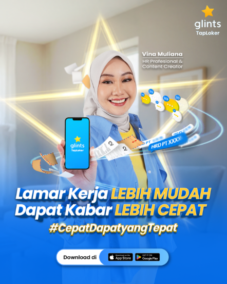
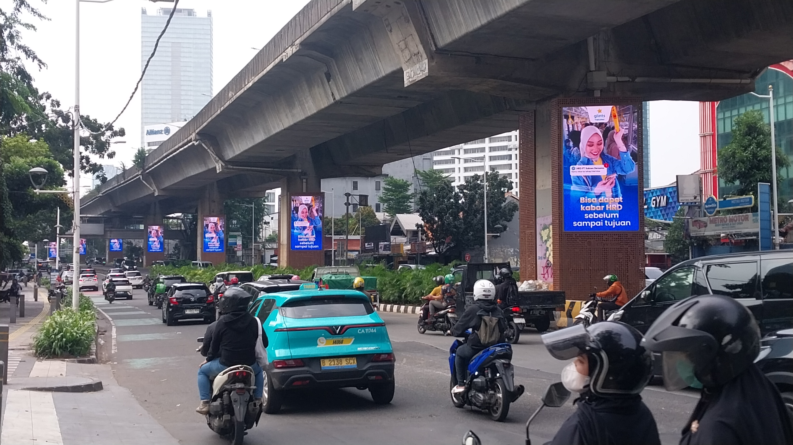
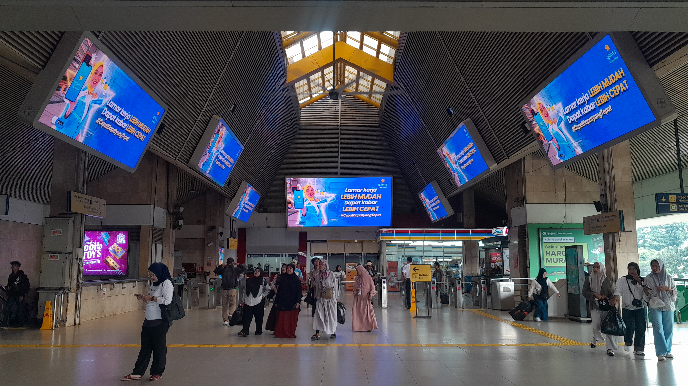

# Marketing Portfolio **Laurice Wong**
👩🏻‍💻Head of Strategy & Marketing @ Glints\
⏳Previously Strategy and Finance @ Deliveroo, Investment Banking @ Goldman Sachs\
🌱Passionate about building solutions for difficult problems across domains - I like to keep my toolkit diverse.

---

🚀 Building Southeast Asia's fastest growing job app at Glints. Created for the region's young and mobile-first workforce and entrepreneurs, our app recognises that direct accessibility and simplicity mattered the most to our users (most of whom are approaching jobseeking and hiring via online channels for the first time in their lives), leading us to pioneer an in-app chat-based hiring process.

🚀 Jobseeking is a long-cycle behaviour that requires significant brand trust. We chose to focus on building a brand narrative combining relatable everyday career struggles and practical jobseeking advice and solutions, led by social media channels, to reach our audiences at every point of their daily working experiences.

---

# Candidate Marketing

## Overall Platform Results (2024–2026)

| Metric | Start | Now |
|---|---|---|
| Monthly Active Users | ~1M | **3M+** (3x) |
| Blended Cost per Install | ~$0.13–0.17 | **$0.07** (-50%) |
| Market position (Indonesia) | #3 | **#1** most downloaded job app |
| Monthly brand content impressions | ~50M | **400M+** (8x) |
| Social media followers | ~700K | **2M+** (3x) |
| % of Organic Installs | ~30% | **70%+** (>2x) |

**Key Growth Levers**
1. Restructured
2. Consolidated social media focus
3. Built KOL strategy from scratch
4. Developed brand strategy and brand refresh

---

## Winning Campaign Case Study — "Cepat Dapat yang Tepat" ("Quickly Get the Right One")

### 2026 H1 Post-Lebaran · March–May 2026

**Why**
- Glints had reached #1 market position in Indonesia but needed to consolidate lead: close the gap on Jobstreet's install volume and MAU, and land a durable brand positioning beyond "another job app"
- Previous campaigns proved that brand awareness investment drives cheaper acquisition downstream. We continued to push towards a sustainable, less paid-dependent acquisition model. Armed with market leadership, 2026 was the year to scale that thesis with a landmark brand campaign with a national KOL to increase product penetration
- Advocated Glints' key product differentiator as the "fastest job app", built on strong observed user sentiment confirming the speed of receiving updates via our chat-to-apply feature as strongest product benefit (vs traditional job portals, where candidates often never hear back)

**Target Audience**
- Indonesian job seekers aged 18–34 across low-white collar, service and blue collar workers
- Targeted commuter and mudik-travel audiences via DOOH at major train stations — people in physical "waiting" moments during transit. Lebaran travel moment created a unique context for DOOH: millions of commuters and mudik travellers with idle time, directly captured by "waiting for train = apply to 5 jobs" messaging

**Strategy**
- Two-phase comms: *Awareness* ("fastest job search") used micro-moment copywriting tied to everyday wait times; *Conversion* shifted to feature-specific pain-point storytelling with Vina's HR credibility as anchor
- Signed Vina Muliana (Indonesia's top HR-professional content creator with 10M+ followers) for 4 dedicated TikTok product videos (one per feature: 1-Tap Apply, Chat with HR, FYP, Jobs Nearby), DOOH usage rights, and IG Live CV review session
- Introduced three novel formats not used in prior campaigns:
  - **DOOH** at 10 commuter/mudik train stations and road sites — contextual placement at moments of maximum idle time
  - **Roblox gamification** — 14-day branded fishing game tied to job roles; unlocked in-game CV review on completion (42K DAP target; 2.8M impressions W1–2)
  - **Sticker branding** at universities, bus stops, ojek helmets — created persistent "waiting = apply" brand association at low cost boosted by UGC and buzzer campaign to drive social media discussion

**Campaign KPIs & Budget**

| KPI | Target | Results |
|---|---|---|
| Total brand content impressions | 425M at $0.16 blended CPM | 660M at $0.13 blended CPM |
| Installs | 2x 2025 peak | Achieved |
| App MAU | 2.5–3M | Achieved and significantly leading closest competitor |

*~40% ahead of 2025 equivalent weeks on install velocity. Vina's organic content garnered >6M impressions. Roblox: 2.8M impressions in 2 weeks supported by organic UGC.*

---

### DOOH and KOL Creative — Vina Muliana Production Stills

|  |

### DOOH Outdoor Placements

| | |
|---|---|
|  |  |
| *Highway / arterial road placement* | *Commuter train station placement* |

### Campaign Video

<video width="100%" controls>
  <source src="images/campaign3-dooh-video.mp4" type="video/mp4">
  Your browser does not support the video tag.
</video>

---

### Vina TikTok Content

| Product Feature | Views | Content Highlights |
|---|---|---|
| [Chat with HR](https://www.tiktok.com/@vmuliana/video/7625949411507490055?lang=en) | 6.8M | Interview tips for lower collar workers |
| [For You Page](https://www.tiktok.com/@vmuliana/video/7636376957734636808?lang=en) | 5.3M | Salary level review for high school and vocational school graduates |

---

### Top-Performing Organic Social & KOL Content

**Owned — [@glintsid](https://www.instagram.com/glintsid/)**

- Organic content centred on two pillars: relatable workplace struggle content and "breaking news" style career advice formatted to stop the scroll
- Consistent use of bold hooks, quick cuts and text overlays to drive thumb-stop rate and shares, turning organic posts into top-of-funnel acquisition

| Post | Views | Theme |
|---|---|---|
| [Tricky HR questions reel](https://www.instagram.com/p/DYMigFJpCYc/) | 1.6M | Interview prep — relatable workplace anxiety |
| [Gig workers to office reel](https://www.instagram.com/reels/DXEWBzkkmFN/) | 1.3M | Career transition — aspirational framing |

**KOL Network**

- Briefed creators on viral-native formats (couple skits, relatable drama) with brand integration kept to a punchy close — preserving entertainment value while driving clear TapLoker awareness
- Selected creators whose organic audiences over-index on blue-collar and fresh-graduate job seekers, matching TapLoker's core acquisition target

| Creator | Platform | Views | Format |
|---|---|---|---|
| [@kn_karisnatalia](https://www.tiktok.com/@kn_karisnatalia/video/7623336302959693074) | TikTok | 3.3M | Humorous couple skit |
| [@arasenata](https://www.tiktok.com/@arasenata/video/7630756324459957525?lang=en) | TikTok | 1.7M | Short drama |
| [@josephalexandertan](https://www.instagram.com/reels/DWgEgFcTm94/) | Instagram | 1M | Humour skit |

---

# Employer Marketing

Employer marketing sits at the intersection of brand credibility, community trust, and enterprise pipeline — positioning TapLoker as the go-to hiring platform for high-volume frontline roles.

**Target Segments**
- **Enterprise accounts** — large corporations running high-volume frontline hiring (logistics, retail, F&B, manufacturing) where cost-per-hire efficiency and applicant quality are the primary buying criteria
- **SMEs** — growing businesses looking for cost-efficient, easy-to-use hiring tools with minimal HR overhead

### Events

- Hosted and co-hosted 4–5 employer-facing events per quarter reaching 500+ hiring managers and HR decision-makers, including TapConnect Client Insight Dinners and HR community roundtables
- Kemnaker Talk Show activation placed TapLoker alongside government-endorsed workforce initiatives, building institutional credibility with both enterprise buyers and SME operators
- HR Community Events facilitated direct peer-to-peer conversations between existing clients and prospects, shortening trust-building in the sales cycle

### Partnerships

- Signed a formal **MOU with Kemnaker** (Ministry of Manpower), covered by [CNN Indonesia](https://www.cnnindonesia.com/) and [IDN Times](https://www.idntimes.com/), establishing TapLoker as a government-aligned platform for national workforce development
- Active collaboration with **SME community networks** — positioning TapLoker as the hiring platform of choice within high-density SME ecosystems and trade associations

### PR & Brand Storytelling

- Kemnaker MOU announcement generated earned media in national digital outlets, reinforcing TapLoker's position as a trusted, government-partnered platform — a key trust signal in enterprise and government-linked employer sales
- LinkedIn content strategy targets HR leaders and C-suite with data-led narratives on frontline hiring trends, talent availability, and cost-of-vacancy — converting brand awareness into inbound enterprise leads

### GTM Strategy

- **Enterprise track:** Account-based outreach targeting high-volume hirers in logistics, retail, and manufacturing — leads are warmed via events and thought leadership before handoff to sales; value prop centres on applicant volume, quality, and cost-per-hire vs. competitors
- **SME track:** Community-led growth through partnership channels and social proof — SME buyers are acquired via peer referral within community networks, then converted through self-serve onboarding and direct sales follow-up for accounts with >10 open roles

---

*For questions on campaign assets or data, contact [laurice.wong@gmail.com](mailto:laurice.wong@gmail.com)*
